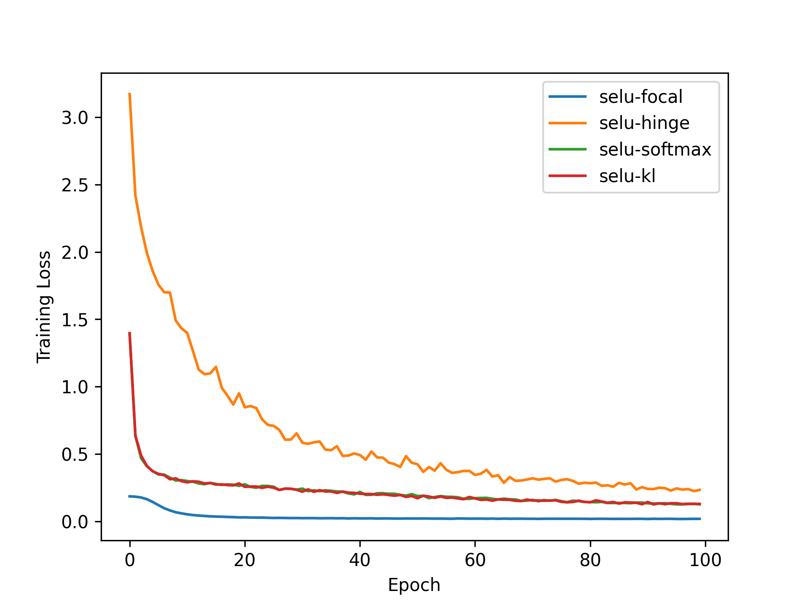
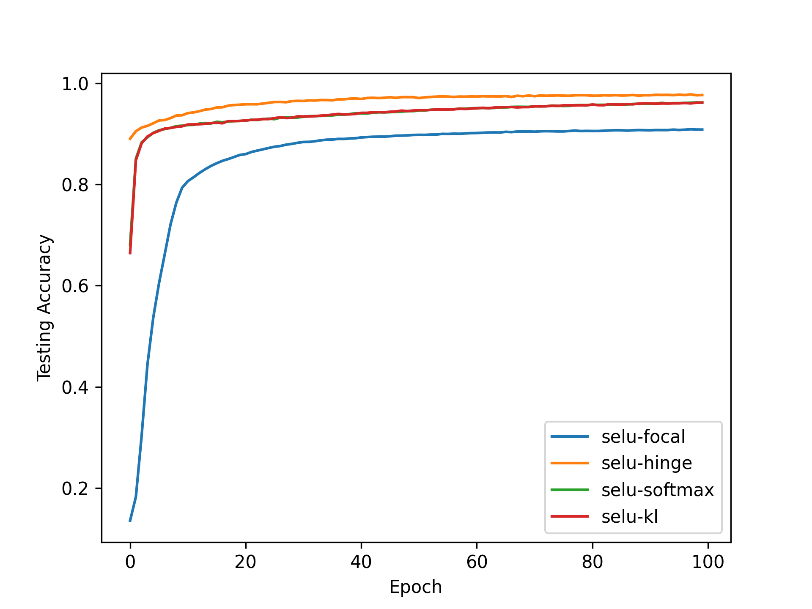
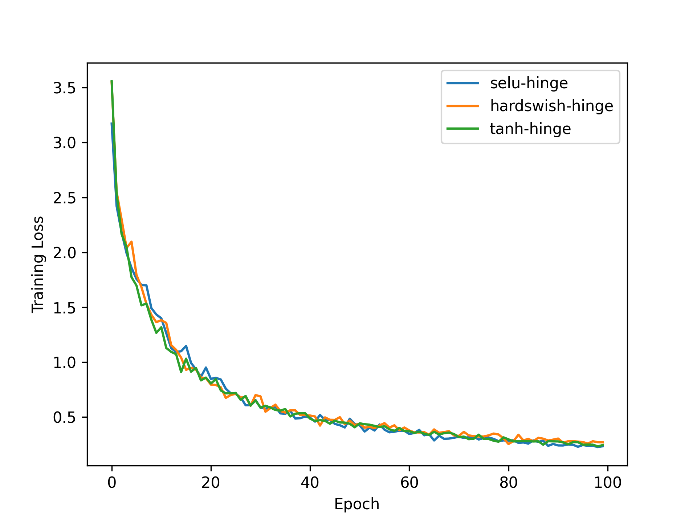
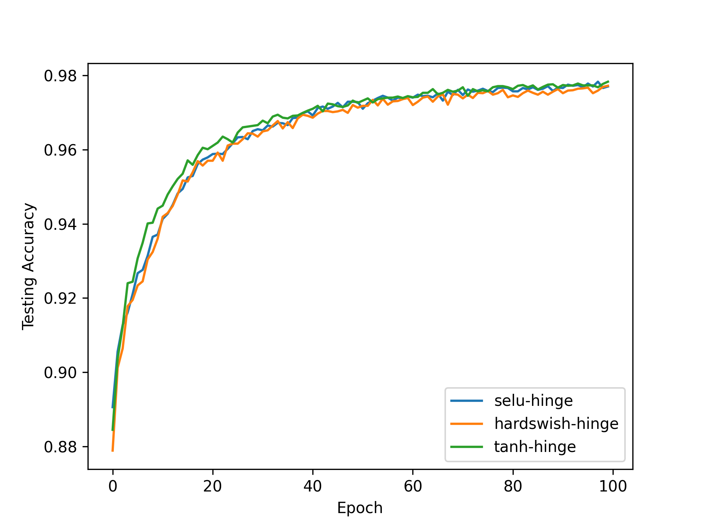
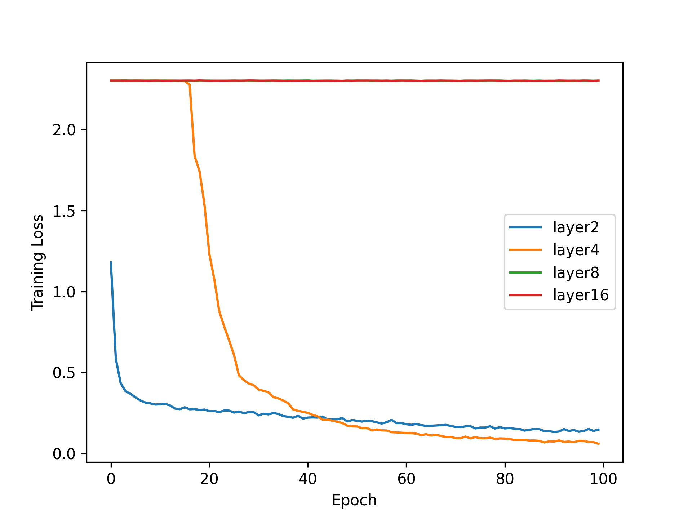
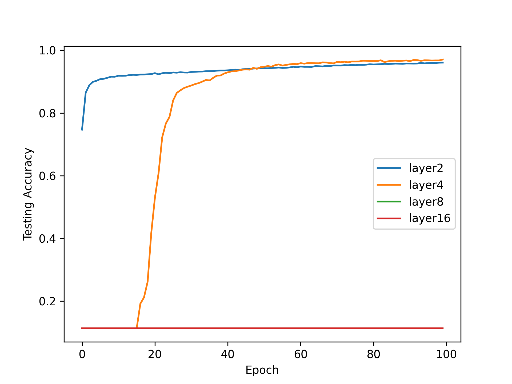
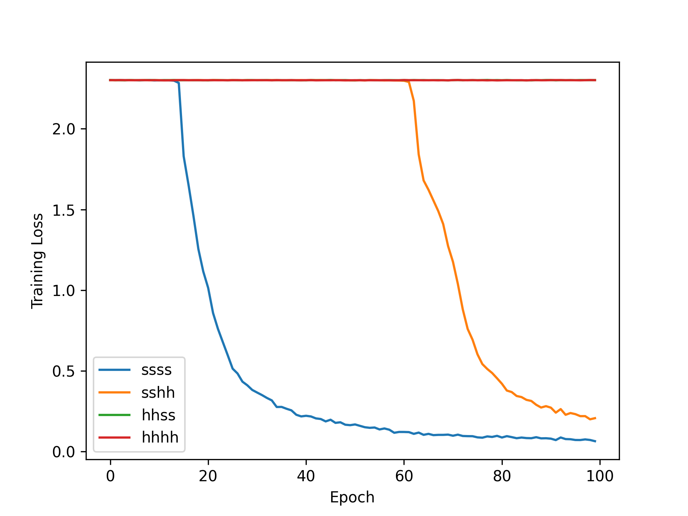
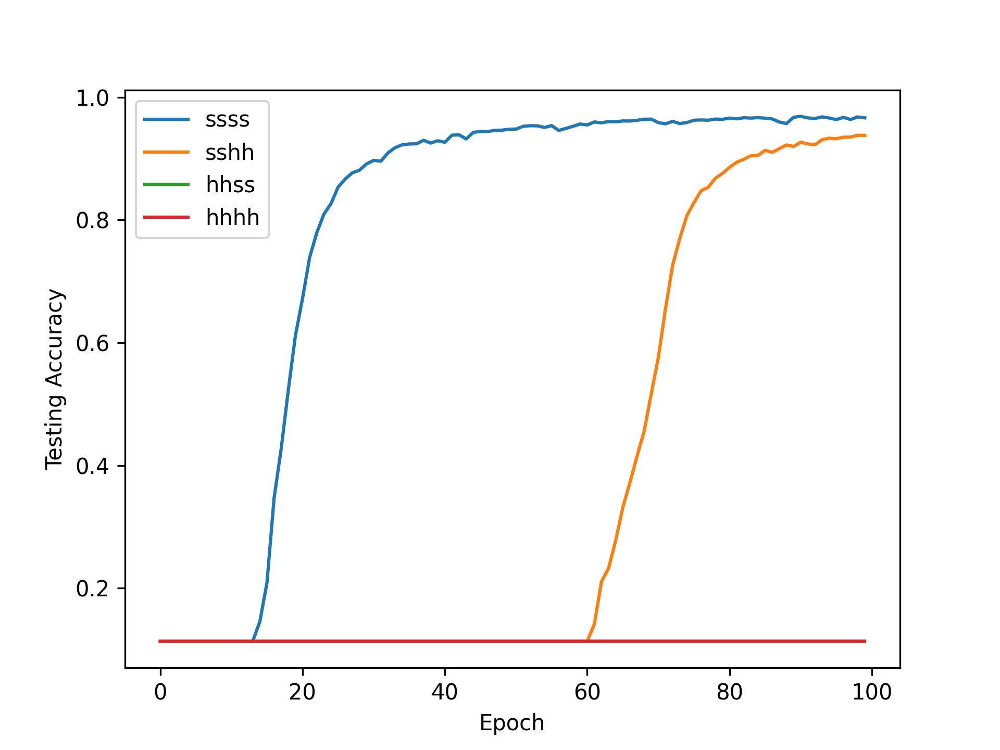

# ANN Autumn24 HW1 (MNIST)

王浩然 计23 2022010229

---

## 实验介绍

本次实验需要手工实现神经网络的前向和反向传播，涉及到链式法则。

Loss 方面：有 `KLDivLoss`、`SoftmaxCrossEntropy`、`HingeLoss`、`FocalLoss`。

函数层方面：有`Selu`、`HardSwish`、`Tanh`、`Linear`。

实验需求

- 画出训练集和测试集的所有 Average & Final Loss / Accuracy
- 单层 MLP，激活函数用 Selu / HardSwish / Tanh；loss函数用 KLDivLoss, SoftmaxCrossEntropyLoss, HingeLoss，检测指标是训练时间、收敛性和 Acc
- 双层 MLP，激活函数用 Selu / HardSwish / Tanh；loss函数用KLDivLoss, SoftmaxCrossEntropyLoss, HingeLoss，检测指标是训练时间、收敛性和 Acc
- 调参数，做 Grid Search
- 实现 FocalLoss， 和 SoftmaxCrossEntrophyLoss 比较

**我的 Bonus 未单独列出，可全文搜索 `Bonus`**

## Grid Search 超参搜索 (Bonus1)

结果请看[此链接](https://wandb.ai/ubec/ANN-24Autumn-HW1_codes/reports/ANN-HW1-grid-search--Vmlldzo5NDk4MjIw?accessToken=2vvb1tbxd2395h9b7bprso6u0hc6kgtjd7wfxwsygly3fkv8u0cdu5kvs7m45ng9)

根据结果，我确定了后续实验的基本参数，请看**损失函数对比实验**和**激活函数对比实验**的默认参数

## 损失函数对比实验

我们使用两层 Linear 夹一个 Activation Fn 的结构，默认参数如下：

| Parameter      | Default Value | Description                              |
|----------------|---------------|------------------------------------------|
| `hidden_state`| `784,128,10`        | Dim of hidden states          |
| `learning_rate`| `1e-5`        | Learning rate for the optimizer          |
| `weight_decay` | `0.1`      | Weight decay for the optimizer           |
| `momentum`     | `0.9`         | Momentum for the optimizer               |
| `batch_size`   | `100`          | Batch size for training                  |
| `max_epoch`    | `100`          | Maximum number of training epochs        |

### `KLDivLoss`

#### Forward

$$\begin{align*} h_k &= P(t_k = 1 \mid \mathbf{x}) = \frac{\exp(x_k)}{\sum_{j=1}^{K} \exp(x_j)} \\ E &= \frac{1}{N} \sum_{n=1}^{N} E^{(n)} = \frac{1}{N} \sum_{n=1}^{N} \sum_{k=1}^{K} t_k^{(n)} \left( \ln t_k^{(n)} - \ln h_k^{(n)} \right) \end{align*}$$

#### Backward

> 推导过程中注意 $\Sigma_{i=1}^kt_j=1$,则$\Sigma_{j\neq k}{t_j^{(n)}}=1-t_k^{(n)}$

$\frac{\partial E}{\partial x_k} = \dfrac{1}{N}(h_k^{(n)} - t_k^{(n)})$

### `SoftmaxCrossEntropyLoss`

#### Forward
$$\begin{align}
P(t_k = 1 \mid \mathbf{x}) &= \frac{\exp(x_k)}{\sum_{j=1}^{K} \exp(x_j)} \tag{1} \\
E &= \frac{1}{N} \sum_{n=1}^{N} E^{(n)} \\
E^{(n)} &= -\sum_{k=1}^{K} t_k^{(n)} \ln h_k^{(n)} \tag{2} \\
h_k^{(n)} &= P(t_k^{(n)} = 1 \mid \mathbf{x}^{(n)}) = \frac{\exp(x_k^{(n)})}{\sum_{j=1}^{K} \exp(x_j^{(n)})}
\end{align}$$

#### Backward
> 和 `KLDivLoss` 是一样的，推导过程中注意 $\Sigma_{i=1}^kt_j=1$,则$\Sigma_{j\neq k}{t_j^{(n)}}=1-t_k^{(n)}$

$\frac{\partial E}{\partial x_k} = \dfrac{1}{N}(h_k^{(n)} - t_k^{(n)})$

### `HingeLoss`

#### Forward
$$\begin{align*}
E &= \frac{1}{N} \sum_{n=1}^{N} E^{(n)} \\
E^{(n)} &= \sum_{k=1}^{K} h_k^{(n)} \\
h_k^{(n)} &= 
\begin{cases} 
0, & \text{if } k = t_n \\
\max(0, \Delta - x_{t_n}^{(n)} + x_k^{(n)}), & \text{otherwise}
\end{cases}
\end{align*}$$

#### Backward
$\frac{\partial h_j^{(n)}}{\partial x_k^{(n)}} = 
\begin{cases} 
-1, & \text{if } j\neq t_n \text{ and } k = t_n \text{ and } s_j^{(n)} > 0 \\
1, & \text{if } j\neq t_n \text{ and } k = j \text{ and } s_j^{(n)} > 0 \\
0, & \text{otherwise}
\end{cases}$

### `FocalLoss` (Bonus2)

#### Forward
$$\begin{align*}
h_k &= P(t_k = 1 \mid \mathbf{x}) = \frac{\exp(x_k)}{\sum_{j=1}^{K} \exp(x_j)} \\
E &= \frac{1}{N} \sum_{n=1}^{N} E^{(n)} \\
E^{(n)} &= -\sum_{k=1}^{K} \left( \alpha_k t_k^{(n)} + (1 - \alpha_k)(1 - t_k^{(n)}) \right) (1 - h_k^{(n)}) \gamma_{t_k}^{(n)} \ln h_k^{(n)}
\end{align*}$$

#### Backward
$$\begin{align*}
\frac{\partial E}{\partial x_k^{(n)}} = \frac{1}{N} &\left[ \left( \alpha_k t_k^{(n)} + (1 - \alpha_k)(1 - t_k^{(n)}) \right) \gamma_{t_k}^{(n)} (1 - h_k^{(n)}) \left( h_k^{(n)} \ln h_k^{(n)} - (1 - h_k^{(n)}) \right) \right. \\
&\left. + \frac{1}{N} \sum_{i \neq k} \left( \alpha_i t_i^{(n)} + (1 - \alpha_i)(1 - t_i^{(n)}) \right) \gamma_{t_i}^{(n)} h_k^{(n)} \left( (1 - h_i^{(n)}) - h_i^{(n)} \ln h_i^{(n)} \right) \right]
\end{align*}$$

| Loss Fn | Acc | Loss | Time |
|----------------|---------------|---|------------------------------------------|
| `KLDivLoss`| 0.9649 | 0.1292 | 152.64s |
| `SoftmaxCrossEntropyLoss`| 0.9655 | 0.1260 | 157.95s |
| `HingeLoss` | 0.9881 | 0.2411 | 165.79s |
| `FocalLoss` | 0.9051 | 0.0179 | 192.68s |





## 激活函数对比实验

我们使用两层 Linear 夹一个 Activation Fn 的结构，默认参数如下：

| Parameter      | Default Value | Description                              |
|----------------|---------------|------------------------------------------|
| `hidden_state`| `784,128,10`        | Dim of hidden states          |
| `learning_rate`| `1e-5`        | Learning rate for the optimizer          |
| `weight_decay` | `0.1`      | Weight decay for the optimizer           |
| `momentum`     | `0.9`         | Momentum for the optimizer               |
| `batch_size`   | `100`          | Batch size for training                  |
| `max_epoch`    | `100`          | Maximum number of training epochs        |

### `Selu`

#### Forward
$f(u) = \lambda \begin{cases} 
u, & u > 0 \\ 
\alpha(e^u - 1), & u \leq 0 
\end{cases}$

#### Backward
$f'(u) = \lambda \begin{cases} 
1, & u > 0 \\ 
\alpha e^u, & u \leq 0 
\end{cases}$

### `HardSwish`

#### Forward 
$f(u) = \begin{cases} 
0, & u \leq -3 \\ 
u, & u \geq 3 \\ 
\frac{u(u+3)}{6}, & \text{otherwise} 
\end{cases}$

#### Backward
$f'(u) = \begin{cases} 
0, & u \leq -3 \\ 
1, & u \geq 3 \\ 
\frac{2u + 3}{6}, & -3 < u < 3 
\end{cases}$

### `Tanh`

#### Forward
$\dfrac{exp(u)-exp(-u)}{exp(u)+exp(-u)}$

#### Backward
$f'(u) = 1 - \left( \frac{\exp(u) - \exp(-u)}{\exp(u) + \exp(-u)} \right)^2$

| Loss Fn | Acc | Loss | Time |
|----------------|---------------|---|------------------------------------------|
| `Selu`| 0.9886 | 0.2334 | 164.57s |
| `HardSwish`| 0.9746 | 0.2168 | 160.13s |
| `Tanh` | 0.9897 | 0.2434 | 165.79s |





## 网络架构对比实验

> 这里我进行了两部分实验，一部分以网络层数为变量，一部分以网络中的激活函数为种类变量

### 使用同一激活函数，改变网络层数

我使用了计算最快的 `HingeLoss` 和 `HardSwish` 函数，令网络层分别为 1, 2, 4, 8, 16，对应的 `hidden states` 如下。

```text
# layers = [784, 245, 10]
# layers = [784, 245, 137, 77, 10]
# layers = [784, 438, 245, 183, 137, 77, 43, 24, 10]
# layers = [784, 586, 438, 328, 245, 227, 183, 137, 102, 77, 57, 43, 32, 24, 18, 13, 10]
```





我还仿 `AlexNet` 架构设计了四层神经网络

```python
AlexNet-inspired architecture for MNIST
model.add(Linear('fc1', 784, 512, 0.005)) 
model.add(Tanh('relu1'))
model.add(Linear('fc2', 512, 256, 0.005))
model.add(Selu('relu2'))
model.add(Linear('fc3', 256, 128, 0.005))
model.add(Tanh('relu3'))
model.add(Linear('fc4', 128, 10, 0.005))
```

结果如下
```text
03:04:45.028 Training @ 49 epoch...
03:04:46.205   Training iter 100, batch loss 0.0113, batch acc 0.9956
03:04:47.406   Training iter 200, batch loss 0.0147, batch acc 0.9950
03:04:48.507   Training iter 300, batch loss 0.0136, batch acc 0.9948
03:04:49.738   Training iter 400, batch loss 0.0264, batch acc 0.9925
03:04:51.138   Training iter 500, batch loss 0.0185, batch acc 0.9923
03:04:52.331   Training iter 600, batch loss 0.0183, batch acc 0.9933
03:04:53.596   Training iter 700, batch loss 0.0240, batch acc 0.9930
03:04:54.772   Training iter 800, batch loss 0.0192, batch acc 0.9936
03:04:55.960   Training iter 900, batch loss 0.0194, batch acc 0.9939
03:04:56.397 Testing @ 49 epoch...
03:04:56.752     Testing, total mean loss 0.13155, total acc 0.97273
```





### 使用不同激活函数，固定网络层数

我固定网络层数为 4，尝试了不同激活函数组合（HS-HardSwish, SL-Selu, TH-Tanh

- HS-HS-HS-HS
- SL-SL-SL-SL
- HS-HS-SL-SL
- SL-SL-HS-HS


这样选的原因是，我认为 `HardSwish` 属于简单激活函数，而 `Selu` 和 `Tanh` 属于复杂激活函数。由于 `hidden states` 选择失误，结果不太好

## 训练稳定性 (Bonus3)

在实际训练中，我发现了两点问题，导致数值溢出
1. 学习率过大
- 现象：我使用了 `Selu` 作为激活函数。在经过大约 2epoch 后，我发现激活函数的输入值均值能达到 50，这导致经过 `Selu` 的 exp 部分时数值溢出
- 原因：梯度爆炸。过大的学习率导致梯度更新过大，导致模型参数在参数空间中跳跃过远，直接发散，比如 `x: 0.1 -> 10`
- 结果：大学习率会导致训练过程不稳定，损失值可能出现大幅波动，难以观察模型的真实性能，甚至无法训练..
2. Softmax 和最大值归一化
- 现象：我在过 `Softmax` 层计算 loss 的时候，发现出现数值上溢
- 原因：因为我的 `input` 和 `batch_size`，求和后会变得难以承受
- 结果：我将分子分母同时除以最大值的指数，即 $\dfrac{e^i-e^{t_{max}}}{\Sigma_j{e^j-e^{t_{max}}}}$通过减去最大值，可以有效防止指数函数的计算结果过大

## 结论

- 不同函数对于训练时间影响很大，比如带指数运算的 `Selu` `Tanh`, `KLDivLoss`, `FocalLoss` 和 `SoftmaxCrossEntropyLoss` ，效果最好但耗时最长，有机会可以做下更 fine-grained 的实验，比如用三阶泰勒代替指数操作
- 最好的激活函数是 `Selu` / `Tanh`，
- 在所有实验中，更换损失函数对结果的影响比更换激活函数明显大。前者决定了你如何拟合真实数据与模型输出，后者只是让不同的 MLP 之间**有区别**。因为 $A\cdot B\cdot C\cdot X=WX(W=A\cdot B\cdot C)$
- 简单堆叠函数层数会提高模型性能（是因为 MNIST 太简单了，如果换成 ImageNet 这种效果差异会很大）。但堆叠更多后，模型表示能力也不会一直增加，会收敛，这也引发了后面 `GoogLenet` 这种并行结构的网络研究。