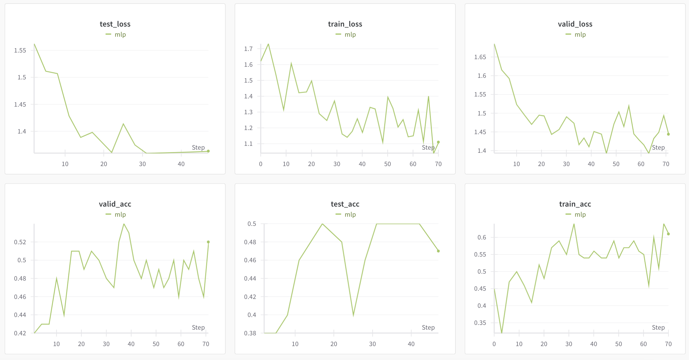
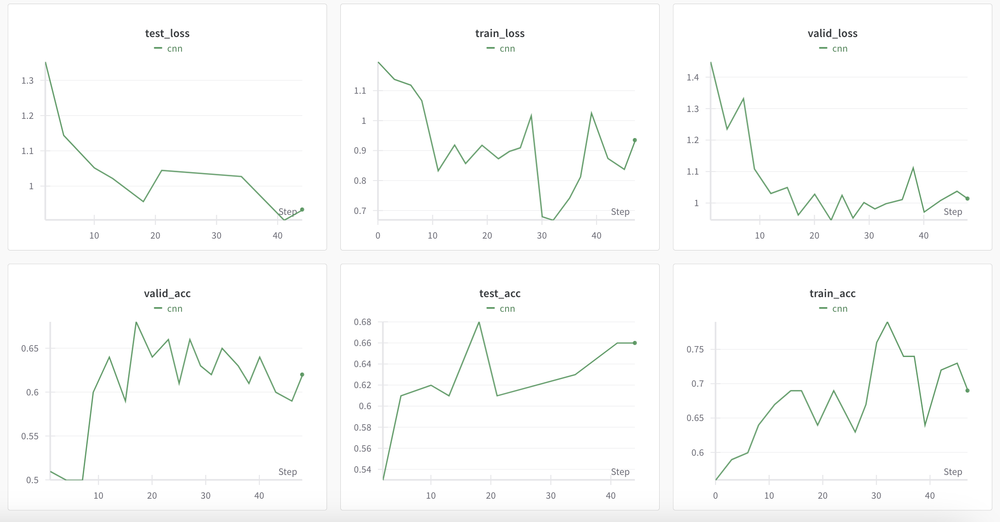
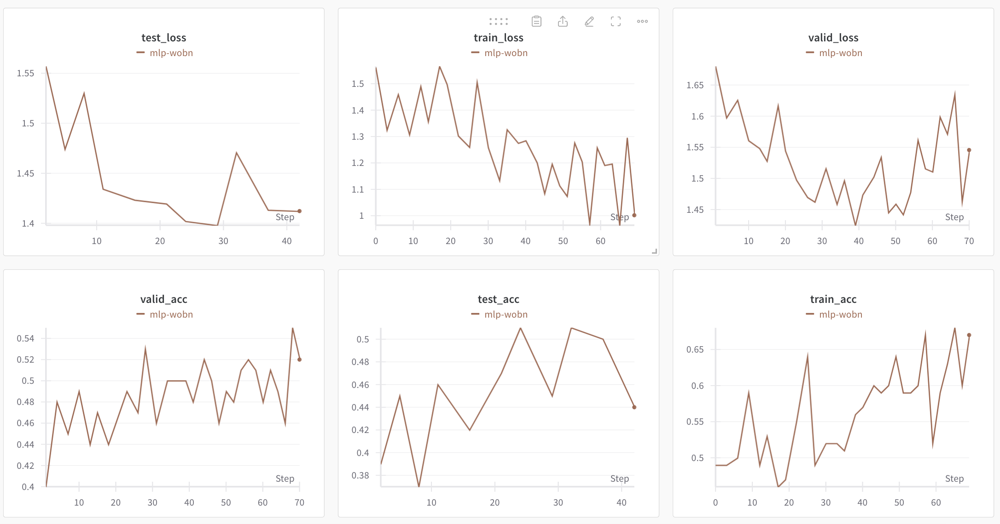
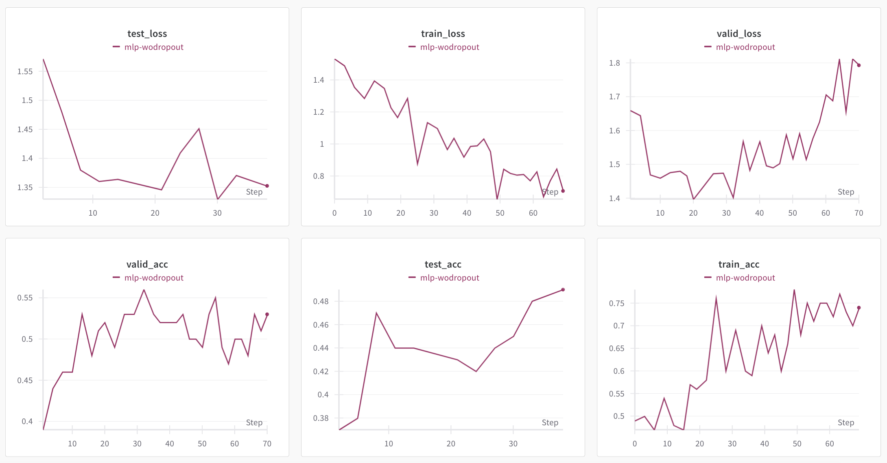
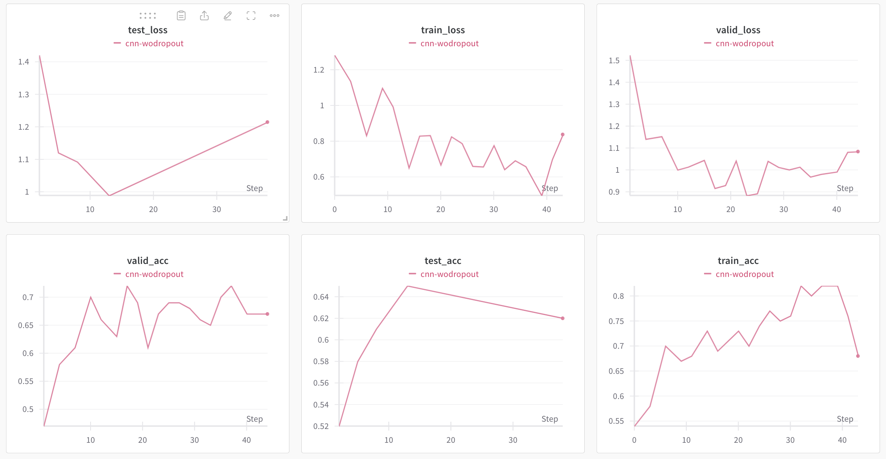
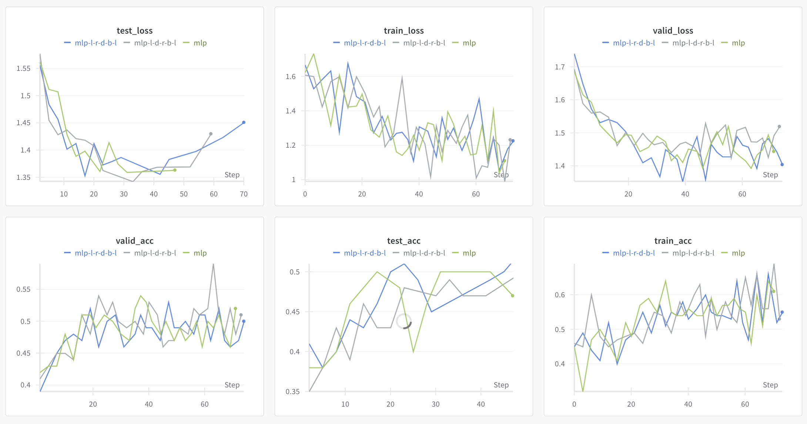
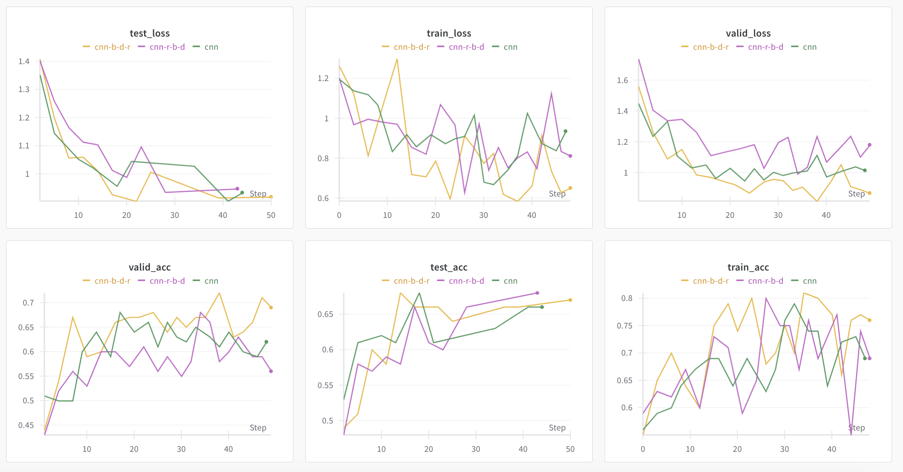
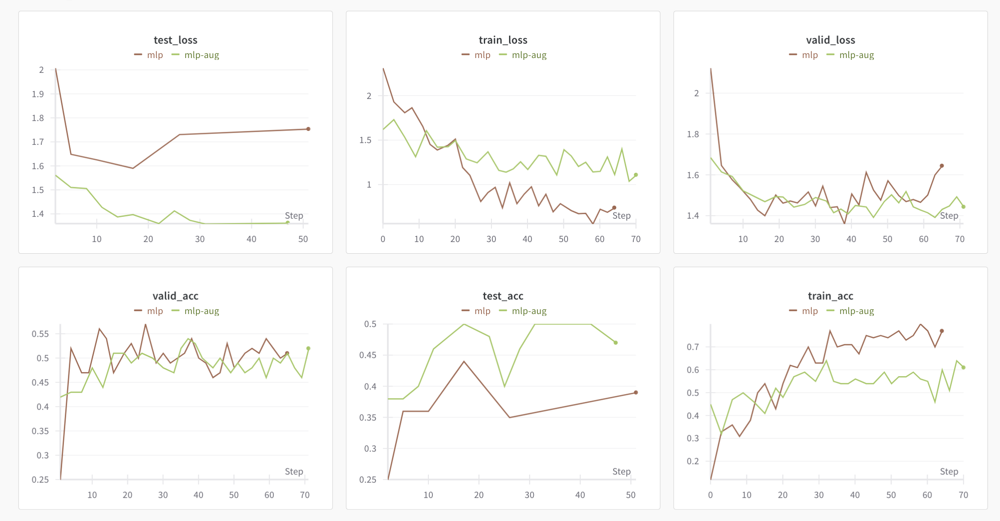

# ANN HW2 CNN

王浩然 计23 2022010229

2024.10.10

---

## `self.training` 解释

以 `mlp` 的实现为例，

BatchNorm1d 中的 self.training：

```python
def forward(self, input):
    if self.training:
        mean = input.mean(dim=0)
        var = input.var(dim=0, unbiased=False)
        
        with torch.no_grad():
            self.running_mean = (1 - self.momentum) * self.running_mean + self.momentum * mean
            self.running_var = (1 - self.momentum) * self.running_var + self.momentum * var
    else:
        mean = self.running_mean
        var = self.running_var

    x_normalized = (input - mean) / torch.sqrt(var + self.eps)
    return self.weight * x_normalized + self.bias
```

在 `BatchNorm1d` 中，`self.training` 决定了是使用当前批次的统计数据（均值和方差）还是使用运行时累积的统计数据。在训练时，我们希望模型适应每个批次的数据分布，而在测试时我们希望使用整个训练集的稳定统计数据。

Dropout 中的 self.training：

```python
def forward(self, input):
    if self.training:
        mask = torch.bernoulli(torch.full_like(input, 1 - self.p))
        return input * mask / (1 - self.p)
    else:
        return input
```

在 `Dropout` 中，`self.training` 决定了是否应用 `dropout`。在训练模式下，其随机丢弃神经元（将它们的值设为0）以防止过拟合。在测试模式下，所有神经元都保持活跃，但我们不需要进行任何缩放，因为在训练时已经通过除以 (1 - p) 进行补偿。

综合来说，

对于 BatchNorm：
- 训练时使用批次统计数据允许模型适应数据的变化。
- 测试时使用全局统计数据确保预测的一致性，不受单个批次的影响。

对于 Dropout：
- 训练时随机丢弃神经元有助于防止过拟合，增强模型的泛化能力。
- 测试时保留所有神经元，以充分利用模型的完整能力进行预测。

## `baseline` 结果

`mlp` 参数

- learning_rate: 1e-3
- batch_size: 100
- epochs: 30
- drop_rate: 0.25
- eps: 1e-5
- momentum (对于移动指数): 0.1



`cnn` 参数

- learning_rate: 1e-2
- batch_size: 100
- epochs: 20
- drop_rate: 0.2
- eps: 1e-5
- momentum (对于移动指数): 0.1



## 训练集和验证集 `loss` 比较

### `loss` 不同原因

1. 过拟合

训练损失是在模型已经学习过的数据上计算的，模型可能开始记忆训练数据中的特定模式，导致训练损失较低；验证损失是在模型未见过的数据上计算的，如果模型过拟合，它在这些未见过的数据上表现会更差，导致验证损失较高。

2. 正则化

诸如dropout或L2正则化等技术通常在训练时是激活的，但在验证时不激活，这可能导致训练损失高于没有正则化时的情况，而验证损失不会直接受到影响。

3. 批量与全集测试

训练损失通常是在一个epoch中多个mini-batch的平均值；验证损失通常是在整个验证集上一次性计算的。

### 超参调整

1. 检测过拟合：

如果训练损失持续下降而验证损失开始上升，这是明显的过拟合信号。这表明需要增加正则化，减少模型复杂度，或收集更多训练数据。

2. 学习率调整：

如果两种损失都在下降但训练损失明显更低，可以增加学习率；如果两者都在稳定下降且接近，学习率可能已经很可以了。

3. 早停：

训练损失和验证损失之间的差距可以帮助确定何时停止训练以防止过拟合。

## 测试集结果

请见第二部分
> `baseline` 结果

其中，

`mlp` 最优效果：`0.52`
`CNN` 最优效果：`0.69`

## 去掉 `BN`

`mlp` 去掉 `BN`



`cnn` 去掉 `BN`


在两种网络中，跳过 `BN` 均会导致最终测试准确率略有下降。这可能是因为批量归一化层能将数据标准化到一个标准分布，使训练过程更加稳定和快速，并给予模型更好的泛化能力。

以及，我们可以看到，在CNN网络中，当我们使用批量归一化时，验证损失和准确率的曲线变得不平滑，这意味着验证过程不稳定。这可能是因为在验证过程中，用于归一化的均值是使用训练过程中的运行均值计算的。这个值可能与当前验证数据的均值不同，导致数据输入略有偏移。理论上，随着训练过程的进行，运行均值会更接近整个数据集的均值，偏移会变小。

## 去掉 `dropout`

`mlp` 去掉 `dropout`



`cnn` 去掉 `dropout`



在两种网络中，跳过 `dropout` 层会导致严重的过拟合。当训练迭代次数足够大时，验证损失开始上升。在 `MLP` 中，验证准确率在 20 个 epoch 之前就达到了最佳值，这也表明了过拟合。因此，我们可以得出结论，`dropout` 层可以防止过拟合。

## Bonus1 交换顺序

基于要求中给出的架构，我交换了 `BN`、`dropout`、`Relu` 和 `Linear` 层的顺序，具体架构请见图注，其中 `b->BN`, `d->dropout`, `r->Relu`, `l->Linear`





结合实验结果，我们可以知道

### BN -> Dropout -> ReLU
BN 在 Dropout 之前可能会导致每个 mini-batch 的统计数据不一致，因为 Dropout 会随机丢弃一些神经元。
Dropout 在 ReLU 之前可能会丢弃一些重要的特征。

### Dropout -> BN -> ReLU
Dropout 在 BN 之前可能会影响 BN 的统计数据计算。
BN 可能会部分抵消 Dropout 的正则化效果。

### ReLU -> Dropout -> BN
这种顺序会导致 BN 层接收到的输入分布变化较大。

## Bonus2 数据增强

```python
train_transform = transforms.Compose([
    transforms.RandomCrop(32, padding=4),  # clip
    transforms.RandomHorizontalFlip(),     # flip
    transforms.ColorJitter(brightness=0.2, contrast=0.2, saturation=0.2, hue=0.1),  # color shift
    transforms.ToTensor(),
    transforms.Normalize((0.4914, 0.4822, 0.4465), (0.2023, 0.1994, 0.2010))  # CIFAR-10 norm parmeter
])
```

我对训练数据进行了数据增强），结果如下。要注意的是 CIFAR-10 有一套自己的归一化系数...



我想，意义如下：
- 增加训练数据量：通过对现有数据进行变换，扩大数据集规模，质量合理的数据多了一般会有效（大模型除外）。但在数据量有限的情况特别有用，可以帮助模型学习到更多的特征变化。
- 提高模型泛化能力：增强后的数据包含了更多的变化和噪声，可以帮助模型学习更鲁棒的特征。减少模型对特定数据特征的过度依赖，提高在真实世界场景中的表现。
- 模拟真实世界的变化：在实际应用中，输入数据可能会有各种变化（如光照、角度、位置等）。数据增强可以帮助模型适应这些变化，提高实际应用中的性能。
- 平衡数据集：对于类别不平衡的数据集，可以通过对少数类进行更多的增强来平衡各类别的样本数量。