# ANN HW4 DCGAN

## 基础实验结果

我设置 `batch_size=64, num_train_steps=5000`，下文无特殊说明均为此设置。我将按照 (latent, hidden) = (16, 16), (16, 100), (100, 16), (100, 100) 的顺序展示我的训练 loss，最后放总图。（请注意，这里的 **MLP** 结果因为命名原因取错了，请直接忽略，真实 MLP 结果可见下文分析）

> 为了保证 FID 结果真实性，我对同一组 ckpt 跑五次生成，取了 FID 平均值

可以看到，GAN 收敛性并不是很好，我刚开始看到 generator 的时候以为写错了（）

**(16, 16): FID: 54.82181428595243**

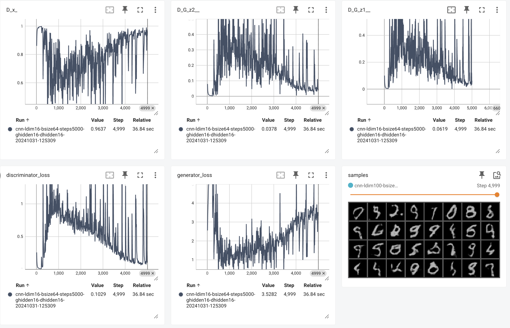

**(16, 100): FID: 40.81386124410318**

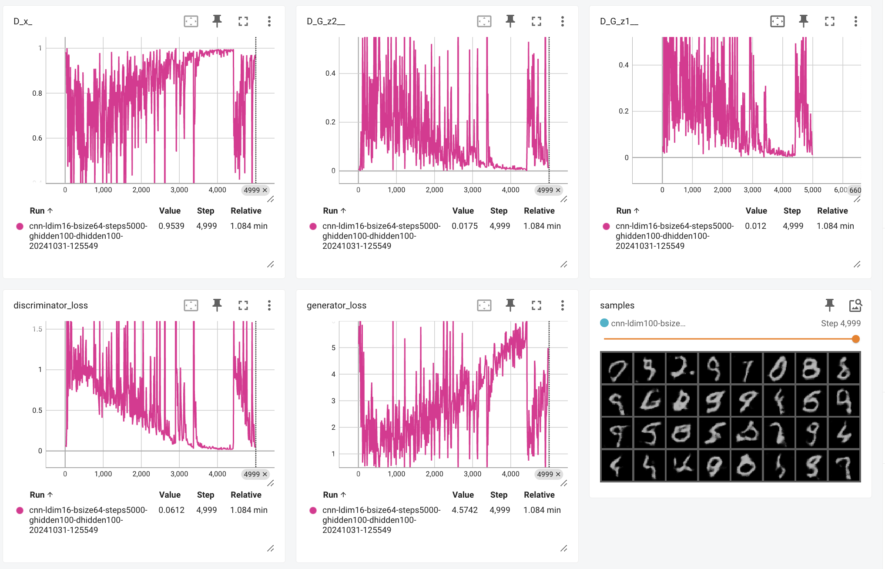

**(100, 16): FID: 65.13555164736758**

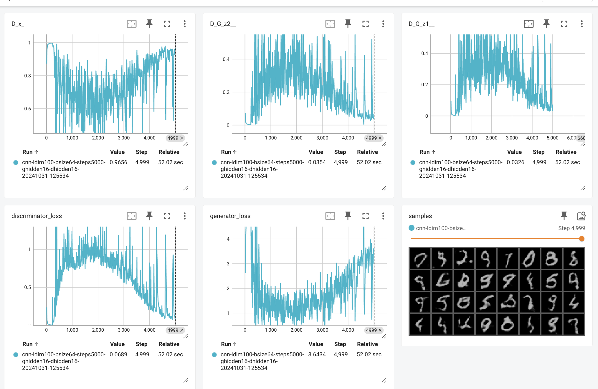

**(100, 100): FID: 36.1812838153958**

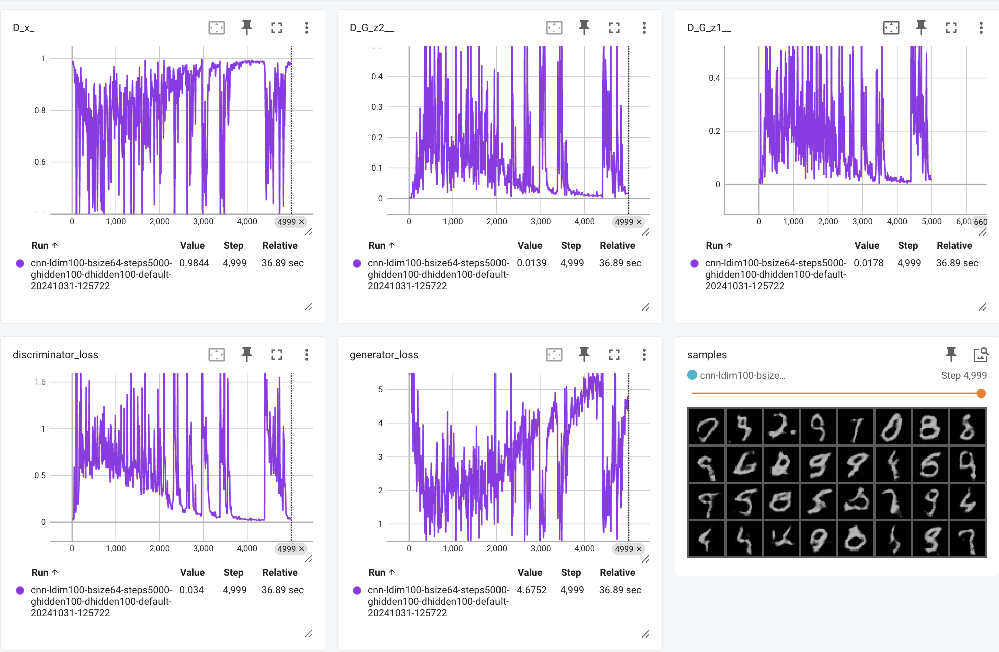

最终跑图（注意，请忽略 MLP，这里放错 ckpt 了）

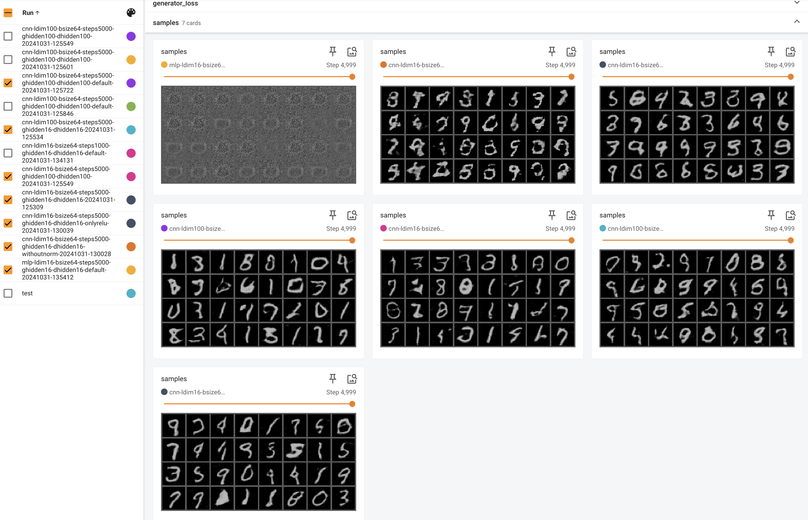

## 维度影响

### `latent_dim`

`latent_dim` 表示输入到生成器的随机噪声向量的维度，服从标准正态分布，并作为生成器的初始输入，影响生成图像的多样性。

其会影响，

- **图像多样性**：较大的 `latent_dim` 通常允许模型编码更多的特征，进而生成更丰富多样的输出。`latent_dim` 过小可能会限制生成器的表达能力，导致生成图像缺乏多样性。
- **细节和复杂度**：较高的 `latent_dim` 能够帮助模型捕捉更多的复杂模式和细节，从而提升图像的质量。然而，`latent_dim` 过大可能会增加训练难度，引入多余的噪声，导致模型过拟合于某些特定模式。
- **训练稳定性**：选择适当的 `latent_dim` 对于稳定训练至关重要。过高的 `latent_dim` 可能使模型难以收敛，生成的图像不一致；过低的 `latent_dim` 则可能导致模式崩溃（mode collapse），即生成器输出的图像缺乏多样性。

### `hidden_dim`

`hidden_dim` 控制生成器和判别器中隐藏卷积层的通道数。在生成器中，它影响每层生成特征的深度，在判别器中则控制提取图像特征的深度。

其会影响，

- **模型容量**：增大 `hidden_dim` 可以提升模型的容量，使其能够学习到更细致、复杂的特征。这可以提升图像的质量，使生成的图像看起来更逼真。然而，`hidden_dim` 过大可能导致模型过拟合，失去泛化能力。
- **分辨率和细节**：更高的 `hidden_dim` 能够使生成器产生更多纹理细节和分辨率较高的图像，这在高分辨率图像生成中尤为重要。同时，它可以帮助判别器更好地区分真实和生成的图像，从而提升对抗训练的效果。
- **训练稳定性和资源消耗**：较高的 `hidden_dim` 会增加计算量，因为每一层处理的特征图更多，这需要更多的内存和计算资源。如果 `hidden_dim` 设置过高，可能导致训练不稳定，如出现梯度爆炸或模式崩溃。

理论上简单数据集的 latent_dim 和 hidden_dim 都可以开很小，但我这里看到的结果是开到 100 效果最好。或许是因为训练数据量比较大？如果拿当前训练集的子集，可能 16 反而效果会好一些，就像我们不能指望拿几 G 数据训一个几百 B 的模型。

**onlyReLU: FID: 51.509368629993475**

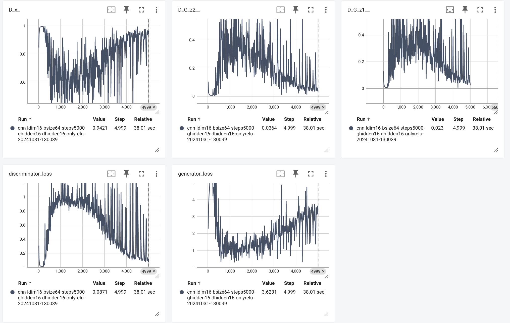

**withoutNorm: FID: 128.045850788972**

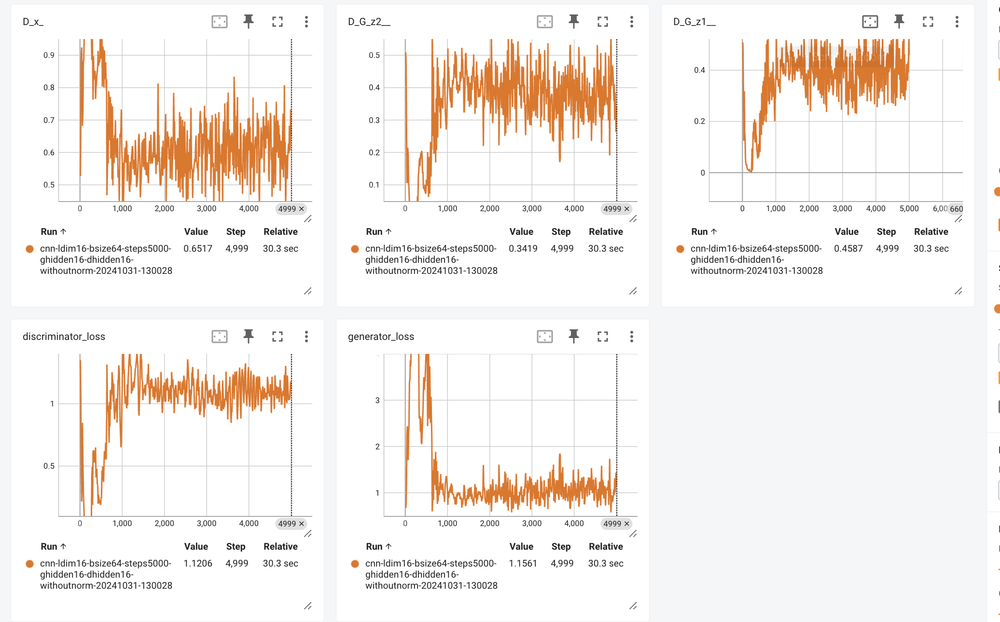

去掉 LeakyReLU 影响不大，但是去掉 norm 层影响巨大，可以从生成图效果中看出来这一点。

### LeakyReLU

**LeakyReLU** 是一种改进的 ReLU 激活函数，在输入为负值时引入了一个小的非零斜率。传统的 ReLU 函数将负输入的输出直接置为零，可能会导致神经元“死亡”（即永远输出零），特别是在训练 GAN 时，这会影响判别器和生成器的学习能力。而 LeakyReLU 通过为负值输入提供一个小的非零输出（例如 \( f(x) = x \) for \( x > 0 \)，\( f(x) = 0.01x \) for \( x < 0 \)），可以有效缓解这个问题。**(这段是抄的)**

> 在 DCGAN 中，通常在判别器中使用 LeakyReLU，因为判别器需要对输入图像的每一层特征做出判断，LeakyReLU 能够更好地捕捉细节并识别生成样本的特征。由于负值部分的输出不完全为零，LeakyReLU 能够在较深的网络中保持梯度流动，帮助判别器和生成器学习更稳定。

### ReLU

**ReLU** 是一种简单的非线性激活函数，定义为 \( f(x) = \max(0, x) \)。它能够有效引入非线性，使模型能够学习更复杂的特征。尽管 ReLU 在负输入时直接将输出置为零，但在生成器中使用它依然有一些优势。**(这段是抄的)**

> 在 DCGAN 中，在生成器中使用 ReLU 可以提高训练稳定性，特别是在生成器网络的中间层，因为这些层更偏向于生成数据分布的抽象特征。由于 ReLU 在负数区域内没有激活输出，生成器在中间层应用 ReLU 有助于抑制不必要的负值特征，使生成器专注于学习和生成重要特征。

### BatchNorm

在 DCGAN 中，norm 层非常重要，主要是因为 GAN 容易出现不稳定的梯度更新！

此外，norm 层还可以
- **加快收敛**：标准化数据分布可以加快收敛速度，因为网络的每一层都可以在相似的分布上进行学习，不需要适应数据分布的剧烈变化。
- **正则化效果**：BatchNorm 具有一定的正则化效果，可以减少模型的过拟合情况，尤其是在生成器中使用 BatchNorm 有助于平滑生成样本的分布。


## Nash 均衡

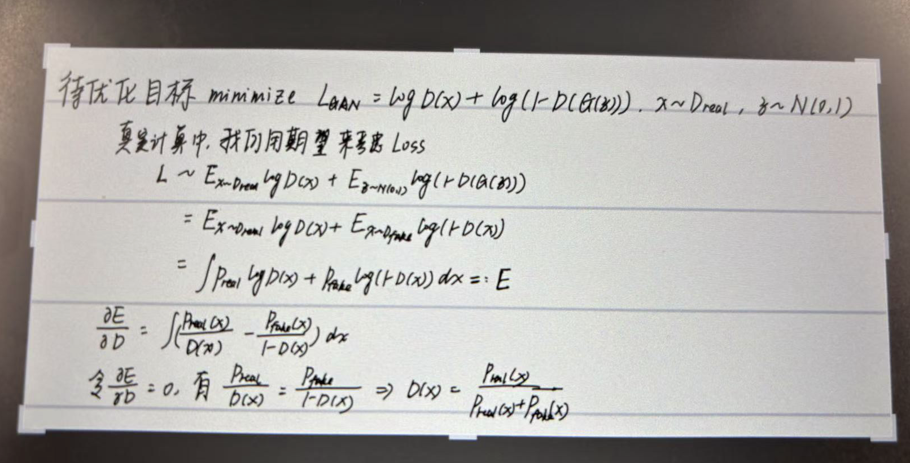


我们不妨以 (16, 16) 这一组训练曲线为例，Discriminator 很容易达到上述最优。比如 D_x 收敛到 1，D_G_z 收敛 0。

当纳什均衡达到时，Generator 应该产生与真实数据无法区分的数据，在这里， D_G_z 应该和 D_x 趋近于 0.5（认为生成真图片和真实图片的概率一样）

但我没有观测到，结果是 Discriminator 比 Generator 更**强**

## 线性插值

我保持 `latent_dim=16` 以及 `hidden_dim=16`，插值轮次为 `20`，变化区间为 `[0, 1]`。我的方法是：在潜空间中选择两个随机向量作为起点和终点，然后在这两个向量之间进行线性插值，生成多个中间向量，从而形成一系列平滑过渡的潜在向量。将这些插值向量输入生成器后，可以得到从一个图像逐渐过渡到另一个图像的效果，最终展示出生成图像之间的连贯变化。

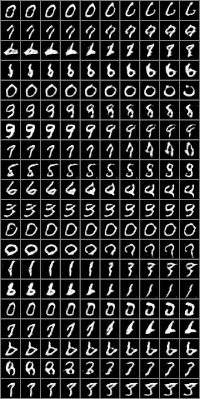

数字之间的变化是连续的，这表明模型学习到了一个连贯的潜在空间，使得潜在向量的小幅变化可以导致输出图像的逐步转变。其中许多行展示了同一类数字的不同风格（如从宽的 “0” 到窄的 “0”；或从弯曲的 “3” 到更直的 “3”）。这反映了模型能够捕捉到类内的多样性，能够生成同一数字的不同书写风格。

此外，这张图中可以看出跨类别过渡：一些行展示了不同数字类别之间的平滑过渡（如 “1” 到 “7” 或 “4” 到 “9”）。在这些过渡中，中间的插值图像可能会出现一些模棱两可的形状，像是两种数字的混合。这表明模型在潜在空间中构建了一个结构化的布局，使不同类别的数字之间可以平滑转换，表现出一定的泛化能力。

## MLP-based GAN

```python
class Generator(nn.Module):
    def __init__(self, num_channels, latent_dim, hidden_dim, arch="cnn"):
        super(Generator, self).__init__()
        self.arch = arch
        self.num_channels = num_channels
        self.hidden_dim = hidden_dim
        self.latent_dim = latent_dim
        self.output_dim = num_channels * 32 * 32  # For mlp output reshape
        self.decoder = nn.Sequential(
            nn.Linear(latent_dim, hidden_dim * 4),
            nn.BatchNorm1d(hidden_dim * 4) if not withoutNorm else nn.Identity(),
            nn.ReLU() if onlyReLU else nn.LeakyReLU(0.2),
            nn.Linear(hidden_dim * 4, hidden_dim * 2),
            nn.BatchNorm1d(hidden_dim * 2) if not withoutNorm else nn.Identity(),
            nn.ReLU() if onlyReLU else nn.LeakyReLU(0.2),
            nn.Linear(hidden_dim * 2, hidden_dim),
            nn.BatchNorm1d(hidden_dim) if not withoutNorm else nn.Identity(),
            nn.ReLU() if onlyReLU else nn.LeakyReLU(0.2),
            nn.Linear(hidden_dim, self.output_dim),
            nn.Tanh()
        )

    def forward(self, z):
        z = z.to(next(self.parameters()).device)
        z = z.squeeze(-1).squeeze(-1)
        out = self.decoder(z)
        return out.view(-1, self.num_channels, 32, 32)

    
class Discriminator(nn.Module):
    def __init__(self, num_channels, hidden_dim, arch="cnn"):
        super(Discriminator, self).__init__()
        self.arch = arch
        self.num_channels = num_channels
        self.hidden_dim = hidden_dim
        self.input_dim = num_channels * 32 * 32  # For mlp input reshape

        self.clf = nn.Sequential(
            nn.Linear(self.input_dim, hidden_dim * 4),
            nn.LeakyReLU(0.2),
            nn.Linear(hidden_dim * 4, hidden_dim * 2),
            nn.BatchNorm1d(hidden_dim * 2) if not withoutNorm else nn.Identity(),
            nn.LeakyReLU(0.2),
            nn.Linear(hidden_dim * 2, hidden_dim),
            nn.BatchNorm1d(hidden_dim) if not withoutNorm else nn.Identity(),
            nn.LeakyReLU(0.2),
            nn.Linear(hidden_dim, 1),
            nn.Sigmoid()
        )

    def forward(self, x):
        x = x.view(x.size(0), -1)  # Flatten the input for mlp
        return self.clf(x).view(-1, 1).squeeze(1)
```

我的 `MLP` 代码大致如下，只是把 CNN 部分变成了 MLP，在输入的时候记得把 2D 图片直接 flatten 到 1D

> MLP 效果图

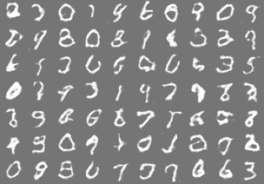

> CNN 效果图，与 MLP 取相同过程推理结果

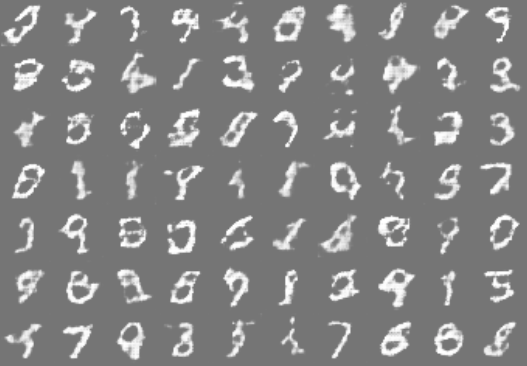

> MLP 训练 loss

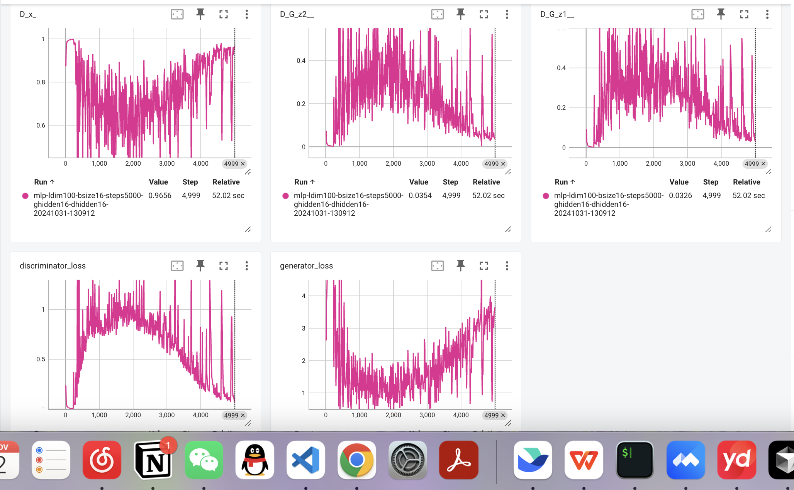

可以看到，MLP 相比 CNN 在数字生成上效果明显好一些，比如右上侧的 9 和右下侧的 3。

我认为这与 MLP 结构简单有关。生成器和判别器两者都是由多层全连接层构成，网络结构相对简单，包含几层非线性激活层（LeakyReLU）和最后一层的输出激活函数（Tanh）。而 CNN 比较复杂。包含一系列上采样层，将潜在向量映射成二维图像。CNN 可以捕捉更复杂的结构，这也是为什么后来 yolo 系列都使用 CNN 而没有基于纯 MLP。

我认为，
- MLP-based GAN 适合对图像质量要求较低的任务，通常用于小型数据集和低分辨率图像生成。
- CNN-based GAN 能生成质量较高的图像，适合复杂的图像数据，在现代 GAN 模型中广泛使用，是 GAN 时代主流的生成架构选择。

## 文生图模型

### DALL-E (OpenAI)

- 扩散模型：DALL-E 2 使用扩散模型，从随机噪声开始，逐步生成清晰的图像。
- CLIP 的图文对齐：CLIP 负责文本与图像之间的对齐，帮助模型准确理解文本描述，确保生成的图像符合输入的语义。

### Imagen (Google)

- 扩散模型生成图像：与 DALL-E 2 类似，Imagen 使用扩散模型从噪声逐步生成清晰图像。多轮的噪声处理步骤使生成的图像具备较高的分辨率和清晰度。
- T5 语言模型：Imagen 采用 Google 的 T5 文本编码器来处理输入文本描述。T5 经过大规模的文本数据预训练，使模型能够理解复杂的文本细节，从而生成更符合描述的图像。

### Stable Diffusion

- 潜在扩散模型：不同于直接在像素空间中处理，Stable Diffusion 在较低维的潜在空间中操作，这种方法提高了生成速度，减少了计算资源的需求。
- 编码图像：Stable Diffusion 使用 变分自编码器 (VAE) 对图像进行编码，将图像压缩至潜在空间，再在扩散生成后解码成图像。这一过程确保了模型生成的图像既高效又具有较高的分辨率。

拉一张表，如下

| 特性                      | **DALL-E**                    | **Imagen**               | **Stable Diffusion**     |
|---------------------------|----------------------------------------|-----------------------------------------|-----------------------------------------|
| **核心架构**              | Transformer (GPT3.5) + Diffusion                 | Transformer (T5) + Diffusion                | Latent Diffusion + VQ-VAE-2        |
| **文本编码**              | CLIP                                  | T5                | OpenCLIP                                |
| **图像生成空间**          | 像素扩散                              | 像素扩散                                | 潜在扩散空间                            |
| **主要优势**              | 多样化图像生成、局部编辑能力           | 高仿真度、细节处理优异                  | 开源、效率高，适用于高分辨率生成        |
| **特长**                  | 复杂场景和风格多样性                   | 高仿真、细腻的面部和物体细节           | 灵活性高，速度快，[开源]                  |


## 附录

运行指令如下

```
python main.py \
    --do_train \
    --latent_dim 16 \
    --generator_hidden_dim 100 \
    --discriminator_hidden_dim 16 \
    --batch_size 64 \
    --num_training_steps 5000 \
    --logging_steps 10 \
    --saving_steps 1000 \
    --arch cnn \
    --tag default
```